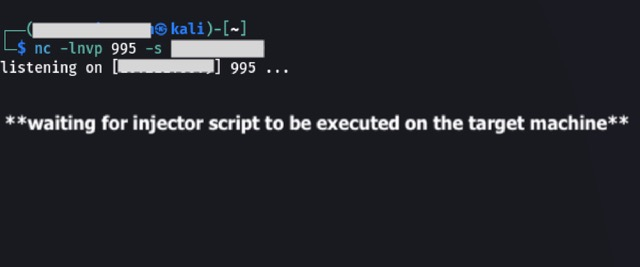
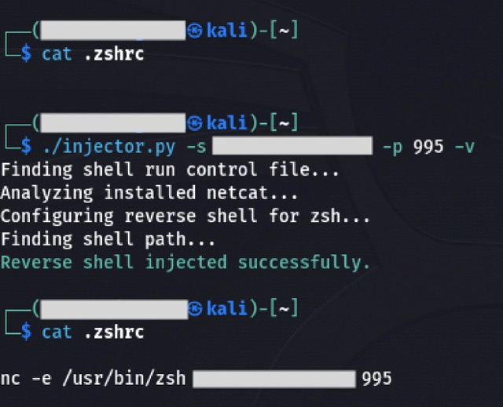
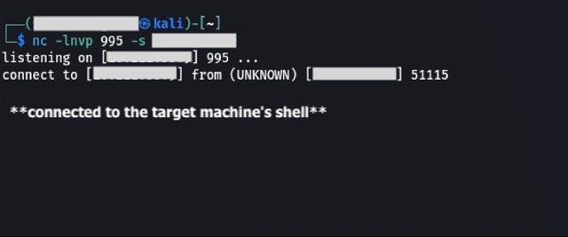

# [EasyInject](https://github.com/codelao/EasyInject)

# Usage
## macOS/Linux
### 1. Start listening on specific port through netcat on client machine (don't use popular ports and keep them under 1000 to avoid problems with firewall):
```
nc -lnvp <port> -s <client_ip>
```
### 2. [Run](https://github.com/codelao/EasyInject#usage) injector on target machine.
### 3. Restart target terminal to apply changes.

# Screens
<p>
    </br>
    </br>
    
</p>
