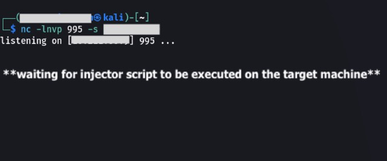

### It's recommended to read main [CToolsF README](https://github.com/codelao/CToolsF/blob/main/README.md) file first.

# Information
#### This tool is made for organizing remote access to a specific machine using `netcat`.

# Usage
## macOS/Linux
### 1. Start listening on specific port through netcat on client machine (don't use popular ports and keep them under 1000 to avoid problems with firewall):
```
nc -lnvp <port> -s <target_machine_ip>
```
### 2. Download script and install dependencies:
```
wget https://github.com/codelao/CToolsF/raw/main/Reverse-Shell/revshell.py && wget https://github.com/codelao/CToolsF/raw/main/Reverse-Shell/requirements.txt && pip3 install -r requirements.txt
```
### 3. Run script with `-h` option to see available arguments:
```
chmod +x revshell.py
./revshell.py <args>
```
or
```
python3 revshell.py <args>
```
### 4. Run script and restart terminal to apply changes.

# Screens
<p>
    </br>
    </br>
    
</p>
